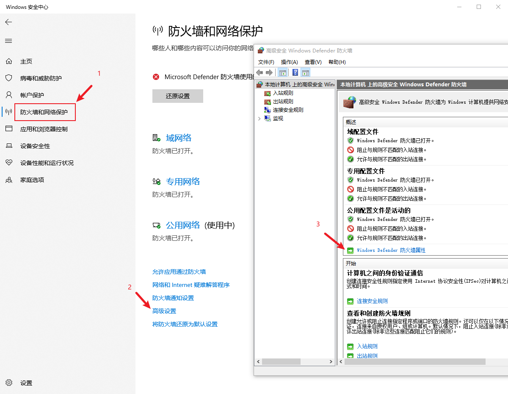
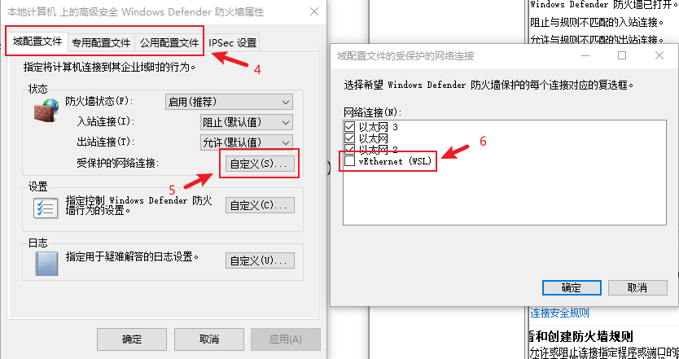

默认情况下 wsl2 无法访问宿主机端口，我们可以通过如下步骤使得wsl2能够访问宿主机：
1. 在 wsl2 下给宿主机添加别名
2. 修改防火墙策略的方式允许 wsl2 访问宿主机。

<!-- more -->

## Step 1. 添加固定别名

保存如下内容至 `/opt/setup_winhost.sh` ([来源](https://github.com/microsoft/WSL/issues/4619#issuecomment-788967893))，记得添加可执行属性：

```bash
#!/bin/bash
# wsl get windows host ip
export winhost=$(cat /etc/resolv.conf | grep nameserver | awk '{ print $2 }')
if [ ! -n "$(grep -P "[[:space:]]winhost" /etc/hosts)" ]; then
	printf "%s\t%s\n" "$winhost" "winhost" | sudo tee -a "/etc/hosts"
fi
```

编辑 `/etc/wsl.conf` ，添加如下内容：

```ini
[boot]
command="/opt/setup_winhost.sh"
```

由于 wsl2 每次启动的时候都会重新生成一份 `/etc/hosts` ，因此没有必要管原先生成的记录。


## Step 2. 配置防火墙

防火墙有两种配置方法，任选其一均可达成目的，此处建议使用方法一。


### 方法一：添加防火墙规则

在具备管理员权限的 `powershell` 中执行如下指令([来源](https://github.com/microsoft/WSL/issues/4585#issuecomment-610061194))：

```powershell
New-NetFirewallRule -DisplayName "WSL" -Direction Inbound  -InterfaceAlias "vEthernet (WSL)"  -Action Allow
```

你会看到类似如下的输出结果：

```powershell
PS C:\windows\system32> New-NetFirewallRule -DisplayName "WSL" -Direction Inbound  -InterfaceAlias "vEthernet (WSL)"  -Action Allow


Name                  : {d6c10e32-a9fe-4217-b474-f351132bb796}
DisplayName           : WSL
Description           :
DisplayGroup          :
Group                 :
Enabled               : True
Profile               : Any
Platform              : {}
Direction             : Inbound
Action                : Allow
EdgeTraversalPolicy   : Block
LooseSourceMapping    : False
LocalOnlyMapping      : False
Owner                 :
PrimaryStatus         : OK
Status                : 已从存储区成功分析规则。 (65536)
EnforcementStatus     : NotApplicable
PolicyStoreSource     : PersistentStore
PolicyStoreSourceType : Local
```

### 方法二：使防火墙在 WSL2 虚拟网卡上不生效

> 注：不建议使用此方法，因为此方法会导致防火墙显示一条告警信息。

如下图所示：





注意：
需要将“域配置文件”、“专用配置文件”、“公共配置文件”三项中的 WSL 网络连接均取消勾选。

